////
Codificación, idioma, tabla de contenidos, tipo de documento
////
:encoding: utf-8
:lang: es
:toc: right
:toc-title: Tabla de contenidos
:keywords: Jenkins
:doctype: book
:icons: font

////
/// activar btn:
////
:experimental:

////
Nombre y título del trabajo
////
= Instalación de Jenkins 2 en Ubuntu 18.04 LTS
Herramientas y Métodos de Ingeniería del Software
Version 1.4, Febrero-2021
Joaquín Cañadas <jjcanada@ual.es>
Manel Mena <manel.mena@ual.es>

// Entrar en modo no numerado de apartados
:numbered!: 

[abstract]
////
COLOCA A CONTINUACIÓN EL RESUMEN
////

Tutorial de instalación de Jenkins 2 en Ubuntu 18.04 LTS.

////
COLOCA A CONTINUACIÓN LOS OBJETIVOS
////
.Objetivos
* Actualizar el sistema Ubuntu 18.04 en caso de que sea necesario
* Instalar Jenkins 2 (última versión)
* Configurar un proxy inverso
* Primeros pasos en Jenkins: configuración básica y plugins

// Entrar en modo numerado de apartados
:numbered:

# Prerrequisitos

## Creación de una máquina virtual para Jenkins
Debes disponer de una máquina virtual en la nube para la instalación de Jenkins. Sigue los pasos que conoces para crear una máquina virtual. 

## Actualización del sistema
### Mensaje de reinicio

Si aparece el mensaje `++***++ System restart required ++***++`
ejecutar
[source,bash]
----
sudo reboot -h now
----

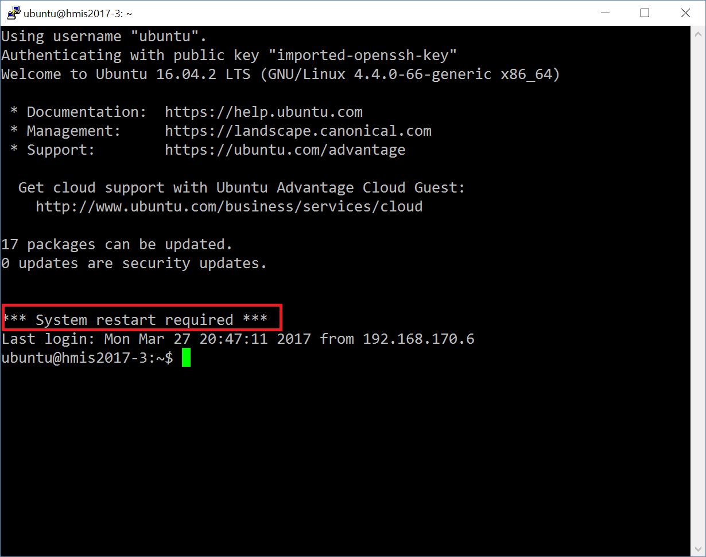

Tras ello, actualizar los paquetes 
[source,bash]
----
sudo apt-get update -y
sudo apt-get upgrade -y
----

## Instalar Java

Puede instalar el JDK con el siguiente comando, es importante instalar al menos la versión 1.8 del JDK, si no Jenkins no funcionará. Aunque ya recomienda usar https://www.jenkins.io/doc/administration/requirements/upgrade-java-guidelines/[Java 11,window=_blank]

[listing]
sudo apt install openjdk-11-jdk -y

Primero comprobaremos si la versión activa de Java es la 11.

[listing]
java -version

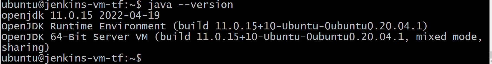

En caso contrario podemos comprobar si hay varias instalaciones de Java en el servidor y elegir la pertinente:
[listing]
sudo update-alternatives --config java

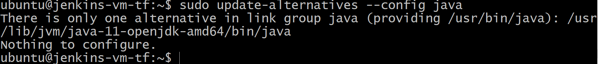

### Definiendo la Variable de Entorno `JAVA_HOME`

[listing]
sudo nano /etc/environment

Al final de este archivo, agregue la siguiente línea, asegurándose de sustituir la ruta resaltada con la  ruta de jdk en su sistema.

[source,bash]
JAVA_HOME="/usr/lib/jvm/java-11-openjdk-amd64"

Guarde, salga del archivo y vuelva a cargarlo.

[listing]
source /etc/environment

Ahora puede probar si la variable de entorno se ha establecido mediante la ejecución del siguiente comando:

[source,bash]
echo $JAVA_HOME

Esto devolverá la ruta que acaba de establecer.

[listing]
/usr/lib/jvm/java-11-openjdk-amd64

# Instalación de Jenkins 2

## Instalación de Jenkins mediante paquetes

Instalaremos Jenkins en un sistema operativo basado en Ubuntu 18.04 LTS o 20.04 LTS. La instalación consiste en añadir los repositorios de Jenkins, actualizar nuestro sistema de repositorios y una vez acabado, instalar Jenkins.

IMPORTANT: Como prerrequisito es necesario tener instalado Java. Compruebe que está configurado JAVA_HOME

Instalaremos Jenkins de la rama estable (versión Long-Term Support, LTS). Hay que tener en cuenta que esta versión de Jenkins se actualiza cada 12 semanas. Si queréis más información sobre la versión LTS de Jenkins, os dejo el enlace https://www.jenkins.io/download/lts/[aqui].

Lo primero que haremos es añadir los repositorios de Jenkins e instalarlo mediante apt-get:

[source,bash]
----
wget -q -O - https://pkg.jenkins.io/debian-stable/jenkins.io.key | sudo apt-key add -

sudo sh -c 'echo deb https://pkg.jenkins.io/debian-stable binary/ > \
    /etc/apt/sources.list.d/jenkins.list'

sudo apt-get update -y

sudo apt-get install jenkins -y
----

A continuación, levantamos el servicio:
[listing]
sudo systemctl start jenkins	

Debido a que `systemctl` no muestra un resultado de estado, utilizaremos el comando `status` para verificar que Jenkins se haya iniciado de forma correcta:

[listing]
sudo systemctl status  jenkins	

Si todo salió bien, la primera parte del resultado de estado mostrará que el servicio está *activo*.

Y comprobamos también que Jenkins está funcionando en el puerto 8080
[listing]
netstat -plntu

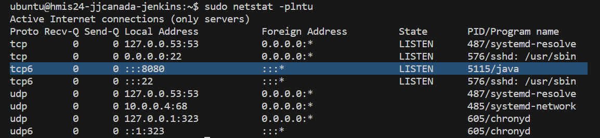

Una vez realizada la instalación por defecto Jenkins estará escuchando en el puerto 8080. Podemos comprobarlo:

[listing]
curl localhost:8080

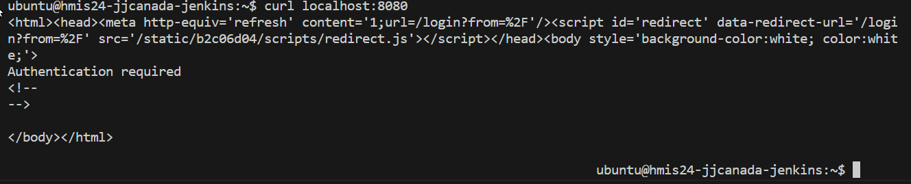

Necesitamos instalar un Apache o Nginx en modo *Reverse Proxy* para poder acceder a la administración de Jenkins mediante el puerto 80 (HTTP).

## Instalación de Apache2 como Proxy Inverso 

Instalamos Apache2 y lo configuramos para que actúe como proxy inverso del puerto 8080.
[source,bash]
----
sudo apt-get install apache2
sudo a2enmod proxy
sudo a2enmod proxy_http
----

La salida esperada debe ser:

[source,bash]
----
Enabling module proxy.
To activate the new configuration, you need to run:
  sudo service apache2 restart
----

Reiniciamos Apache2:
[source,bash]
----
sudo service apache2 restart
----

Comprobamos que Apache2 está funcionando en el puerto 80:

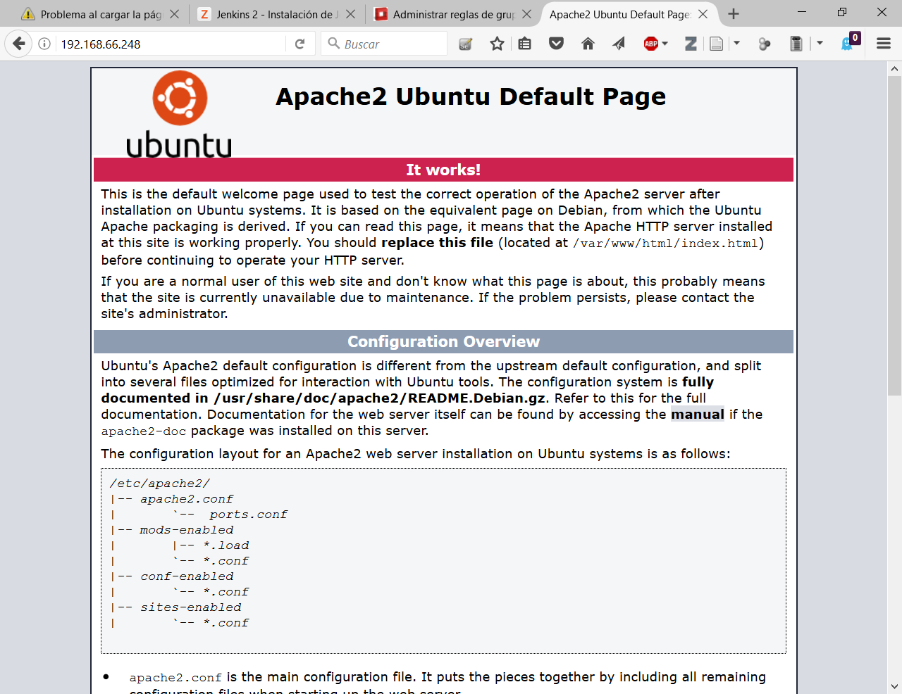

A continuación, creamos un nuevo archivo de host virtual en la carpeta 'sites-available'

[listing]
sudo nano /etc/apache2/sites-available/jenkins.conf

Copiamos el siguiente texto como contenido del archivo, sustituyendo el texto _JENKINS.MACHINE.IP_ por la DNS generada en AZURE de la máquina (ver ejemplo en la captura de pantalla abajo):

[source,conf]
----
<Virtualhost *:80>
    ServerName        JENKINS.MACHINE.IP <1>
    ProxyRequests     Off
    ProxyPreserveHost On
    AllowEncodedSlashes NoDecode
 
    <Proxy http://localhost:8080/*>
      Order deny,allow
      Allow from all
    </Proxy>
 
    ProxyPass         /  http://localhost:8080/ nocanon
    ProxyPassReverse  /  http://localhost:8080/
    ProxyPassReverse  /  http://JENKINS.MACHINE.IP/ <2>
</Virtualhost>
----
<1> Recuerda sustituir `JENKINS.MACHINE.IP` por el DNS de la máquina virtual en Azure donde has instalado Jenkins.
<2> Recuerda sustituir `JENKINS.MACHINE.IP` por el DNS de la máquina virtual 

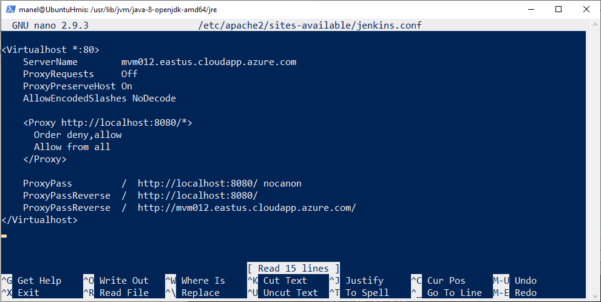

Guardamos el archivo. Y activamos el host virtual de Jenkins con el comando *a2ensite*

[listing]
sudo a2ensite jenkins

Reiniciamos Apache2 y Jenkins
[source,bash]
----
sudo systemctl restart apache2
sudo systemctl restart jenkins
----

Y por último, comprobamos que los puertos 80 y 8080 están usados por Apache2 y Jenkins, respectivamente.

[listing]
netstat -plntu

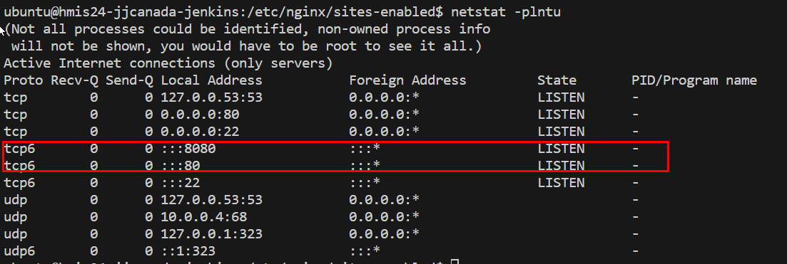

# Configuración de Jenkins 2
## Primera configuración de Jenkins

Antes de realizar la primera configuración necesitaremos saber el password temporal de admin que Jenkins ha generado para poder empezar a configurarlo:

[listing]
sudo cat /var/lib/jenkins/secrets/initialAdminPassword

Copiamos el password y lo pegamos en la siguiente pantalla, y hacemos click en btn:[Continuar]

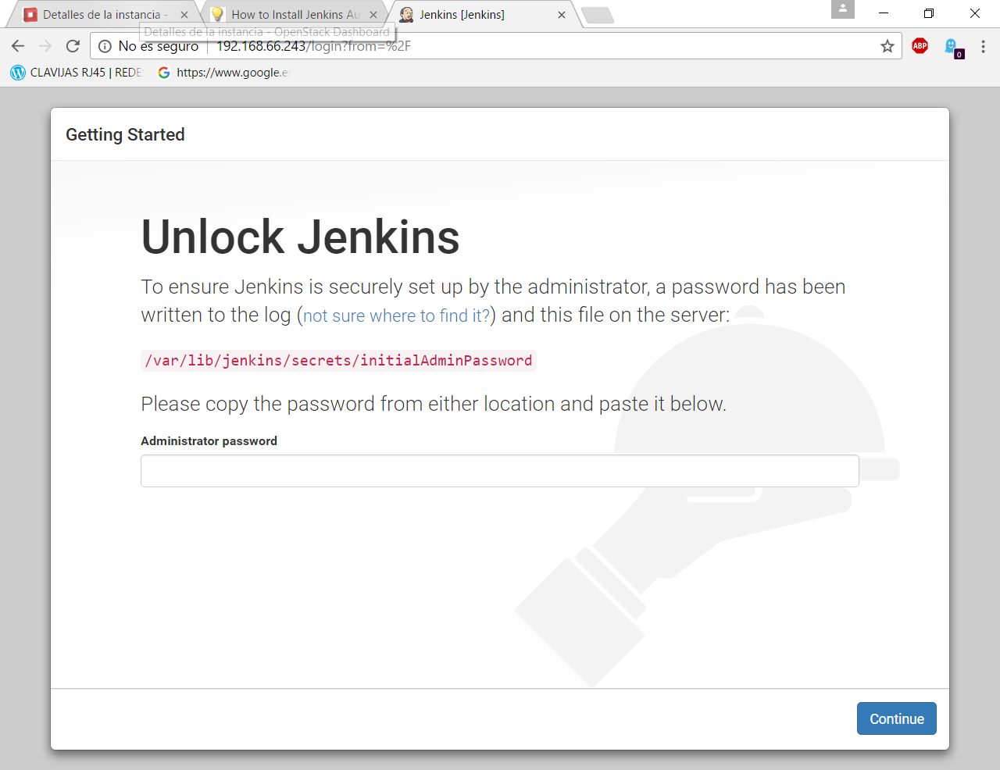

Seguidamente instalaremos los plugins más comunes. No os preocupéis que posteriormente instalaremos varios plugins más, de hecho una de las grandes ventajas que tiene Jenkins es la gran cantidad de plugins que hay.

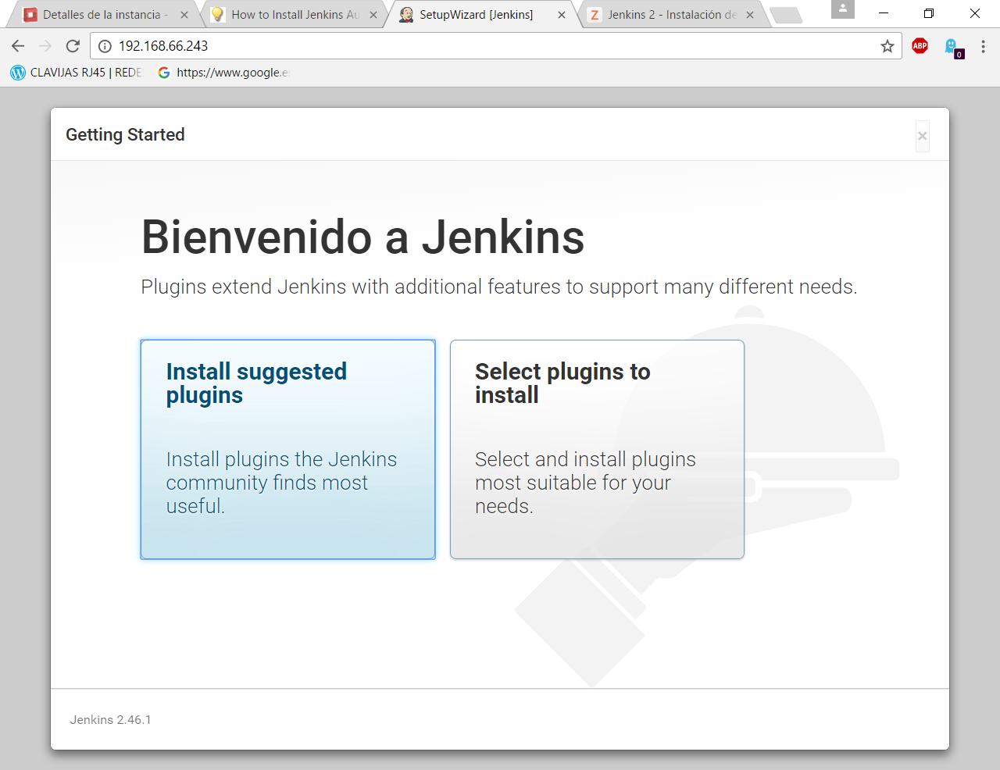

Tras hacer clic en *Install suggested plugins*, el proceso de instalación de plugins tardará unos minutos:

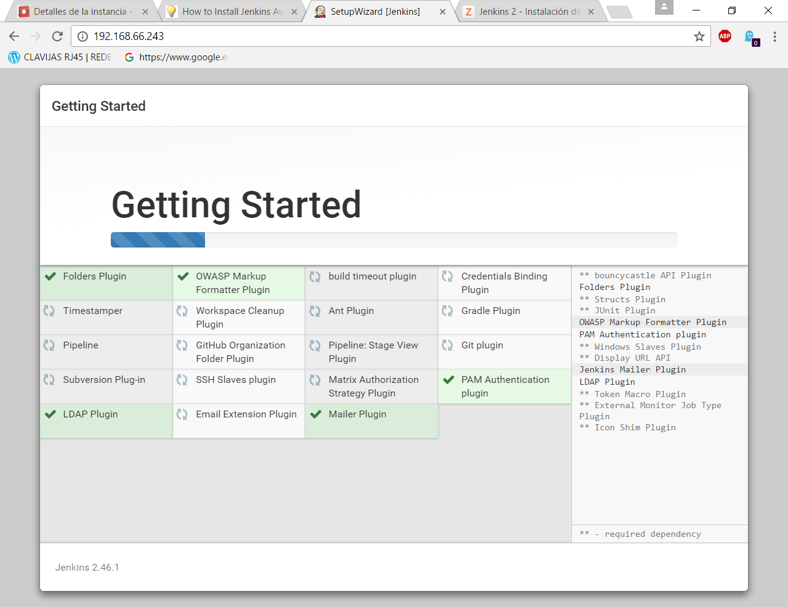

Seguidamente nos solicitará un usuario y una contraseña de *admin*, el cual usaremos posteriormente poder acceder a la administración de Jenkins:

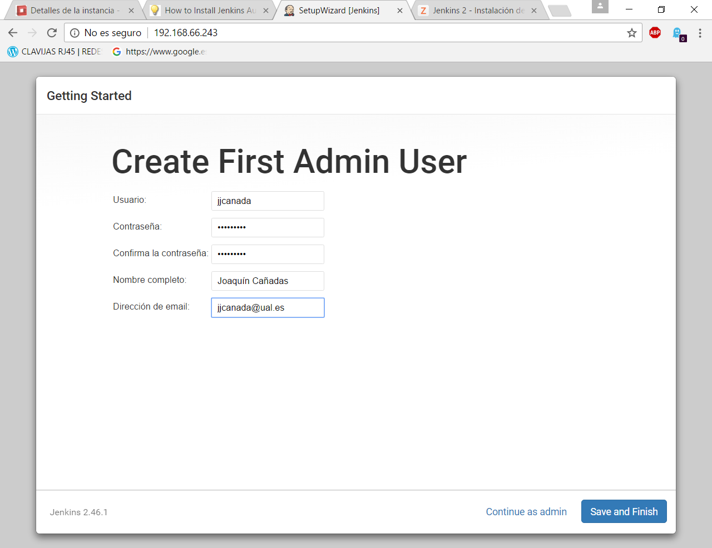

Pulsamos el botón btn:[Save and Finish]

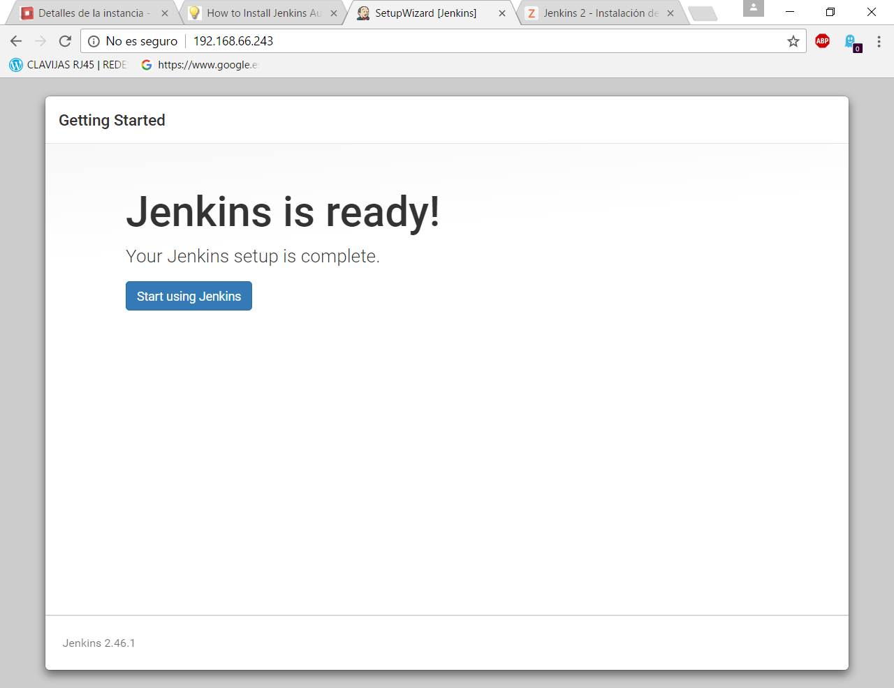

Ya podemos acceder a Jenkins introduciendo el usuario y contraseña que acabamos de crear.

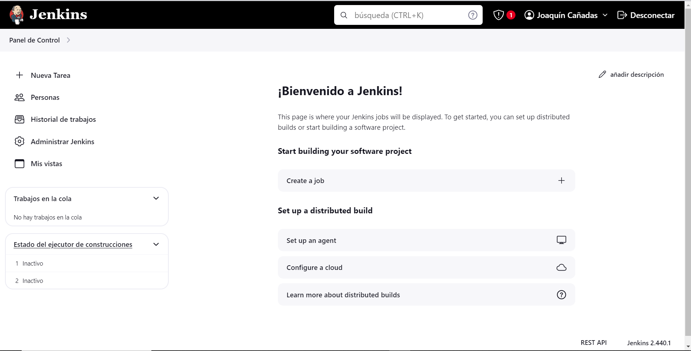

## Securizando Jenkins

Las versiones anteriores de Jenkins (v1.x) se instalaban sin ningún tipo de control de acceso para los usuarios. Esto implicaba que cualquier usuario podía usar la aplicación, lo que era totalmente desaconsejable. Por ello, lo primero era activar la seguridad. La versión actual (v2.x) crea un usuario Admin con el que hemos hecho el primer acceso, pero, en cualquier caso, sigue siendo necesario configurar la seguridad para poder gestionar el acceso a nuevos usuarios. Para ello, hacemos clic en *Administrar Jenkins* / *Configuración global de seguridad*.

// image::images/Picture15.png[Configuración global de seguridad]

Jenkins permite diversos *modos de acceso*. Vamos a configurar el más básico que es el de *Usar base de datos de Jenkins*, y marcamos *Permitir que los usuarios se registren*. A continuación, en la sección *Autorización*, marcamos *Configuración de seguridad*. En el campo de texto debemos escribir el nombre del usuario admin con el que hemos accedido, y a continuación hacer clic en el botón btn:[Añadir]. Tras ello, debemos marcarlo como *Administer*. Y por último btn:[Guardar]

image::images/Picture16.png[Autorización. Configuración de seguridad]

.Qué hacer si nos hemos bloqueado y no podemos acceder
[WARNING]
====
En caso de emergencia, si olvidamos la contraseña o no podemos acceder a Jenkins, debemos seguir las instrucciones definidas aquí: https://wiki.jenkins-ci.org/display/JENKINS/Disable+security[Help! I locked myself out!]. 

Más info en https://wiki.jenkins-ci.org/display/JENKINS/Securing+Jenkins[Securing Jenkins]
====

Podemos registrar nuevos usuarios mediante el formulario de registro de la página inicial (no estando logueados). Cada miembro del equipo debe registrarse como usuario. Mediante el usuario administrador damos permisos a los nuevos usuarios registrados. 

.Control de acceso con LDAP
[NOTE]
====
El método de acceso más recomendable sería tener un sistema LDAP para el equipo, y que la validación de todas las herramientas (GitLab, Jenkins, etc) se realizase contra el LDAP (esto se podría implementar con, por ejemplo, https://www.openldap.org/[OpenLDAP]).

Más info:

* https://wiki.jenkins-ci.org/display/JENKINS/Standard+Security+Setup[Jenkins standard security setup]
* https://wiki.jenkins-ci.org/display/JENKINS/LDAP+Plugin[LDAP plugin]
====

## Probando un primer proyecto

Desde la página inicial de Jenkins, clic en *Nueva Tarea* (_Create new Job_)

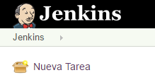

* Nombre: *prueba de sistema*
* Seleccionar: *Crear un proyecto estilo libre*
* btn:[Ok]

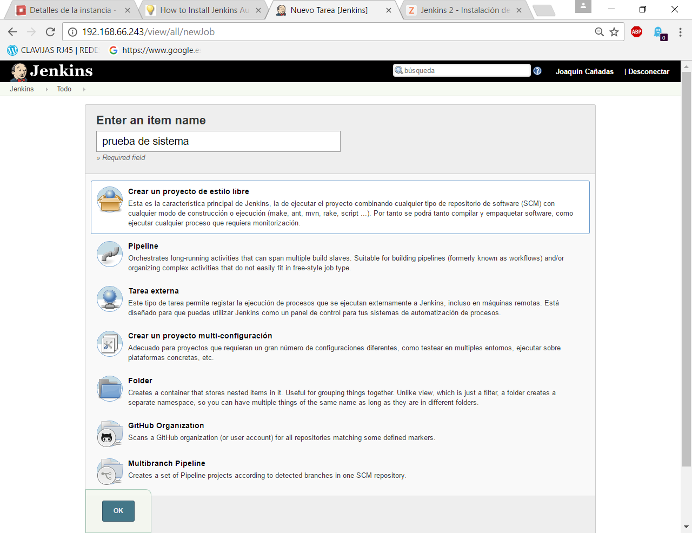

Entramos en la configuración del nuevo proyecto. Seleccionamos la pestaña *Ejecutar*

* Seleccionamos el botón *Añadir un nuevo paso*
* Seleccionamos *Ejecutar línea de comandos (shell)*
* En comando escribimos
+
[listing]
top -b -n 1 | head -n 5

* Pulsamos *Guardar*

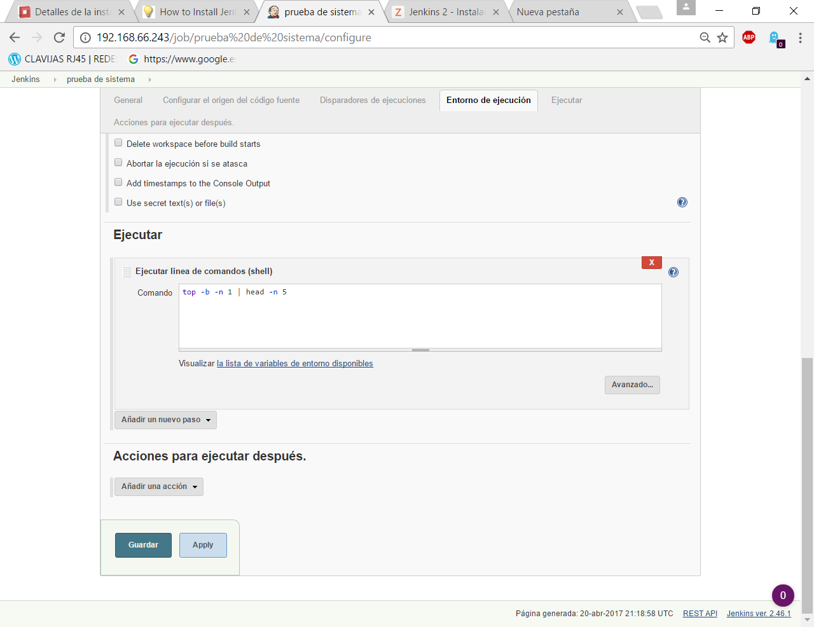

Tras ello hacemos clic en *Construir ahora* (_Build now_)

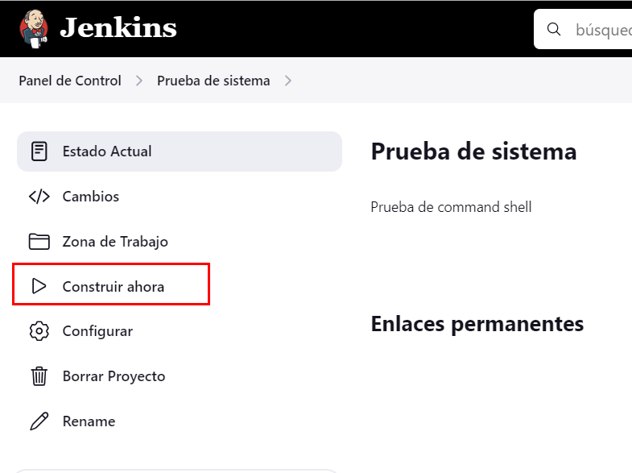

Tras la ejecución del proyecto, se puede ver el *Historial de tareas*, hacemos clic en la bolita azul de la primera ejecución y nos mostrará la *Salida de Consola*. Ahí podemos ver el resultado de la ejecución de este proyecto de prueba en Jenkins. 

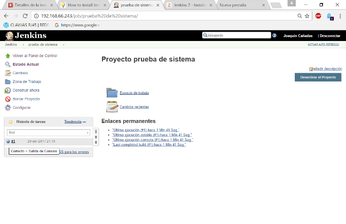
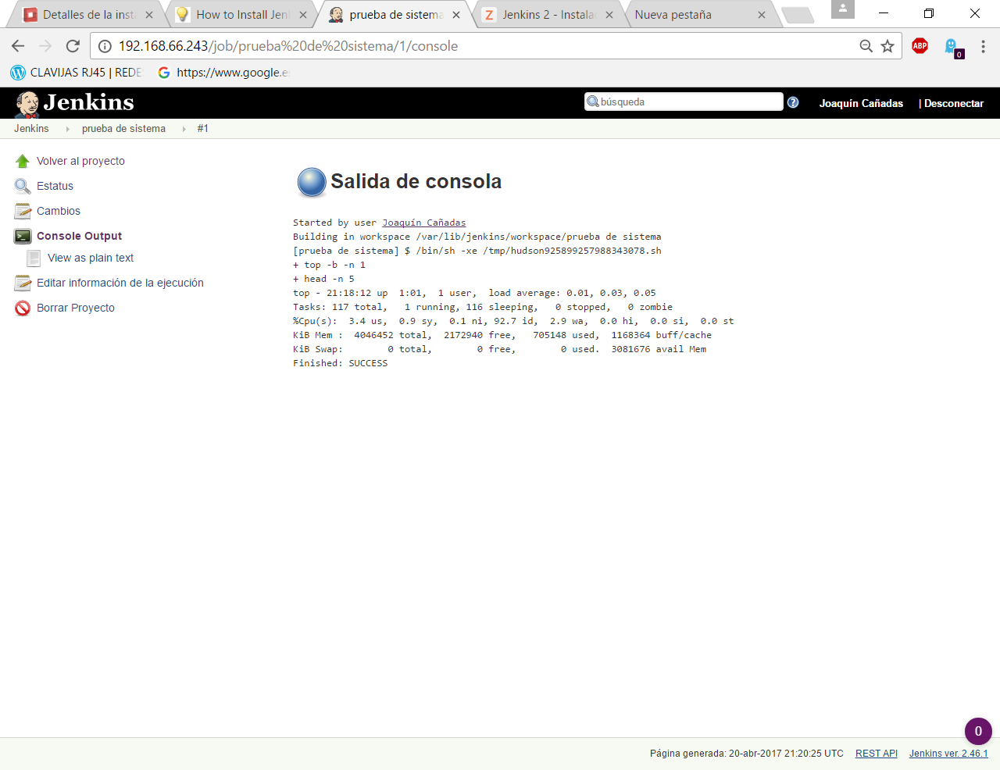

## Configuración de herramientas

Jenkins hace uso de diversas herramientas a las que invoca a la hora de realizar tareas en la construcción de los proyectos. Estas herramientas deben ser instaladas y configuradas. Para ello vamos a *Administrar Jenkins* / *Global Tools configuration*

// image::images/Picture18.png[Crear un proyecto estilo libre]

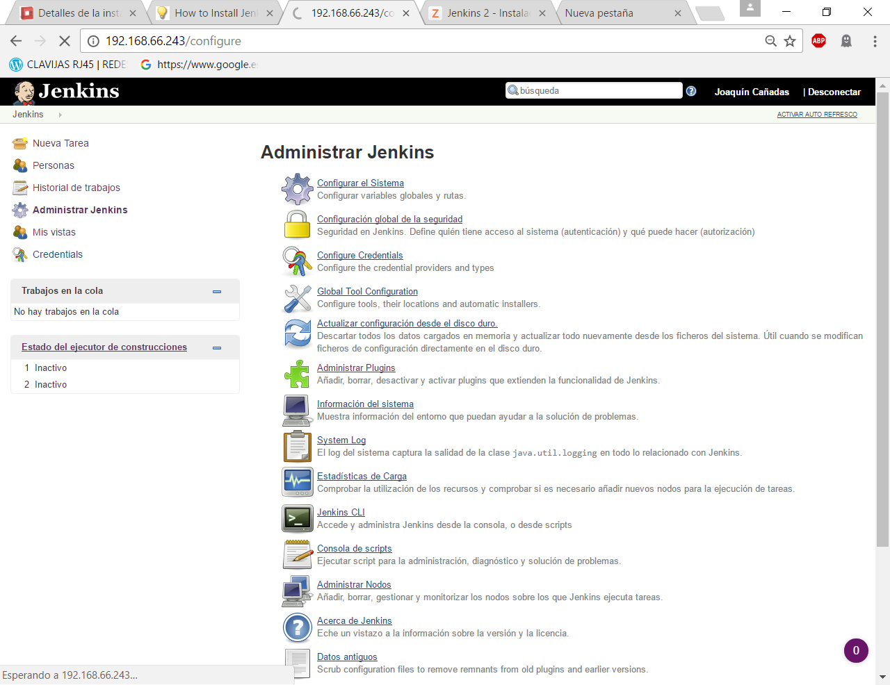

### JDK
* btn:[Añadir JDK] 
* Nombre: *OpenJDK-11* 
* JAVA_HOME: */usr/lib/jvm/java-8-openjdk-amd64/*
+
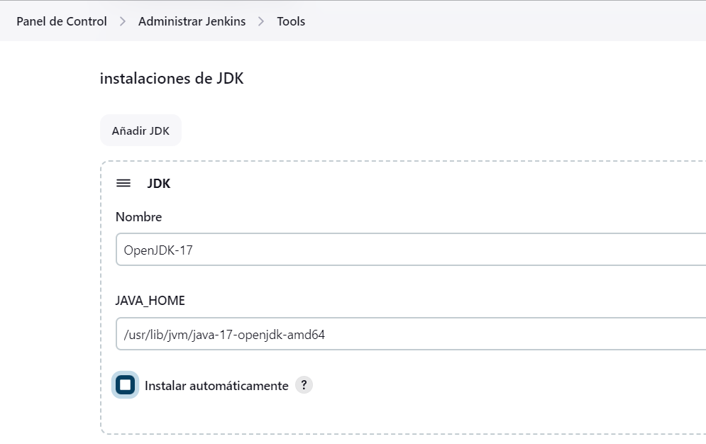

### Git
* btn:[Añadir Git] 
* Nombre: *Default*
* Path: *git*

[NOTE]
====
Suponemos que git ya está instalado previamente en la máquina. En caso contrario instalarlo desde el terminal
[listing]
sudo apt-get install git
====

### Ant
* btn:[Instalaciones de Ant...] / btn:[Añadir Ant] 
* Nombre: *ant 1.10.12*
* Marcar *Instalar automáticamente*
* Version: *1.10.12*

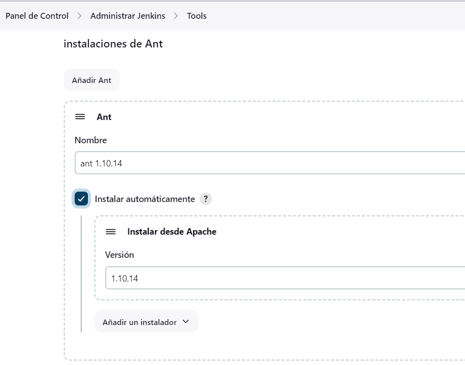

### Maven
* btn:[Instalaciones de Maven...] / btn:[Añadir Maven] 
* Nombre: *maven default*
* Marcar *Instalar automáticamente*
* Version: *la última versión disponible*

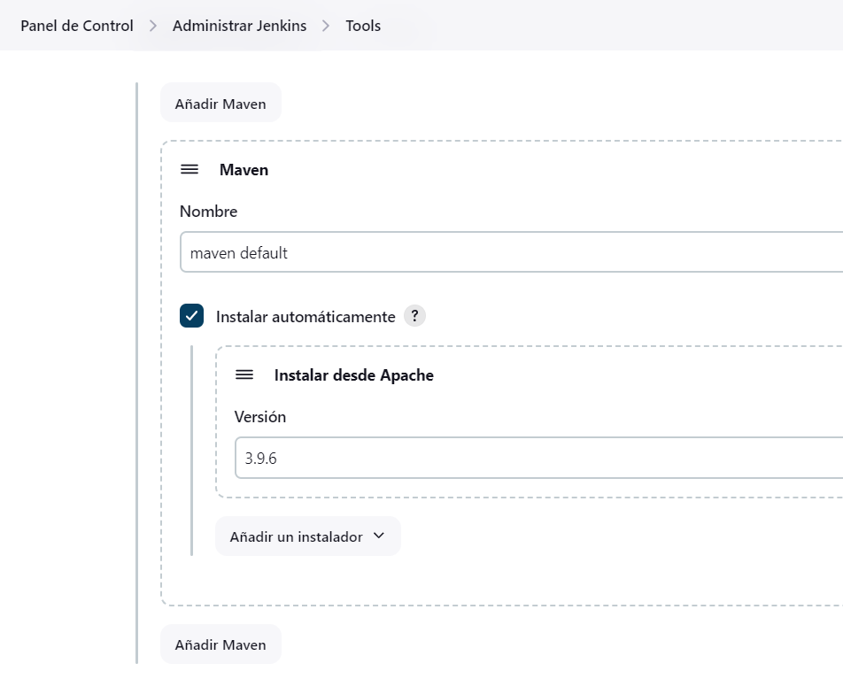

[NOTE]
====
Seleccionamos la ultima versión de Maven disponible en el desplegable. (La 3.5.0 da muchos problemas!)
====

[WARNING]
====
En caso de que no esté disponible la configuración de instalaciones de Maven, este paso deberá hacerse una vez realizada la instalación del plugin de Maven.
====

## Instalación de plugins
La gestión de los plugins se realiza desde *Administrar Jenkins* / *Administrar plugins*. 

En la pestaña *Actualizaciones disponibles* (_Update_) debemos marcar todos los que se muestren y mantenerlos actualizados. 

La pestaña *Todos los plugins* (_Available_) muestra la lista de todos los plugins que no tenemos instalados. De ella tenemos que seleccionar los siguientes:

* Maven integration plugin
+
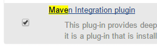

* Cobertura plugin
+
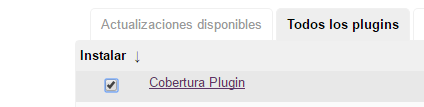

* JaCoCo (Java Code Coverage)
+
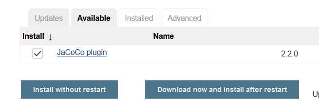

* GitLab 
+
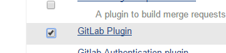

* SonarQube
+
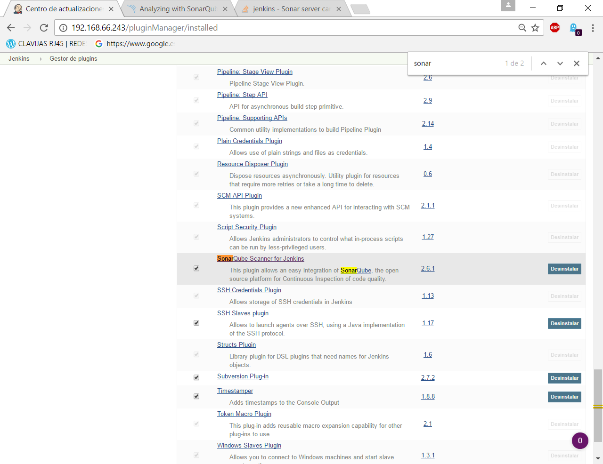

Tras ello, hacemos clic en *Descargar ahora e instalar después de reiniciar*. Y marcamos *Reiniciar Jenkins después de la instalación*

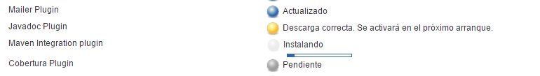

## Configuración Adicional (opcional)

Opcionalmente, puede ser necesario realizar alguna configuración adicional. Por ejemplo si queremos construir aplicaciones PHP con Phing debemos instalar el plugin de Phing en Jenkins, así como instalar Phing en la máquina.

Recuerda que hay infinidad de plugins en Jenkins, y si quieres usar alguno de ellos solo tienes que instalarlo. Existe numerosa documentación de Jenkins en la web.

En caso de duda --> _Stackoverflow_ ;-) 

### Configuración de GitLab

Si queréis usar vuestro propio GitLab con Jenkins, tendréis que hacer una configuración de GitLab indicando la URL y el API Token. El API Token es un valor ligado al usuario de GitLab disponible en *User Settings* / *Account*:

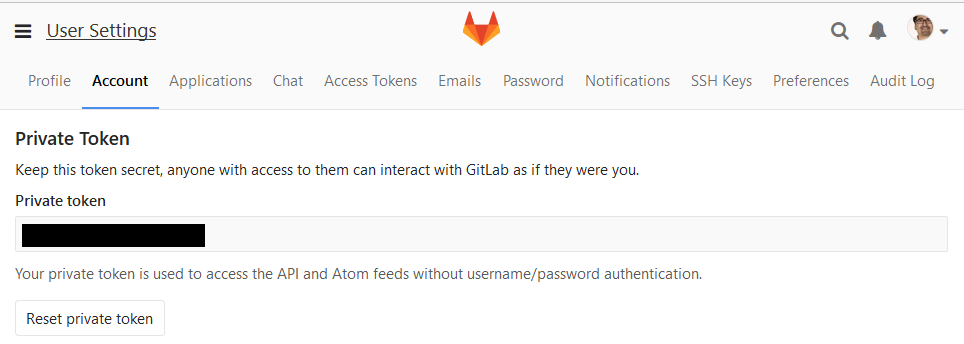

A continuación, en Jenkins, introducimos la configuración del servidor Gitlab: *Administrar Jenkins* / *Configurar sistema*. Al  final de la página encontrarás la sección de GitLab.

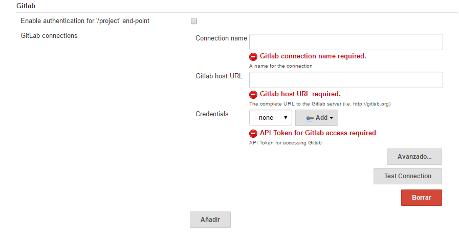

* Nombre de la conexión: _mi gitlab_
* Gitlab Host URL: http://_mi_IP_gitlab_
* Credenciales: *Añadir*
** Tipo: *GitLab API token*
** API token: _mi token_
** ID: _mi-gitlab_
** Descripción: _token de mi gitlab_
+
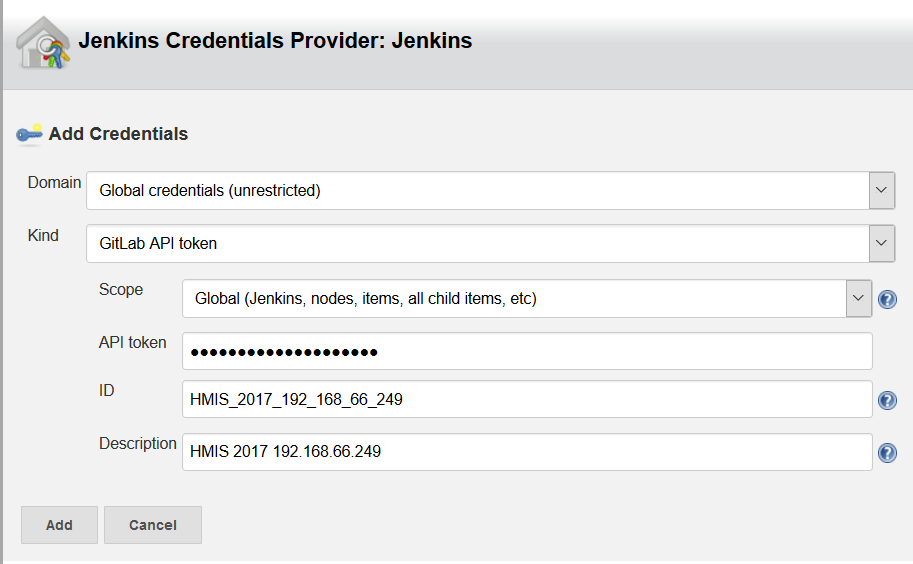
+
Tras ello seleccionamos la credencial:

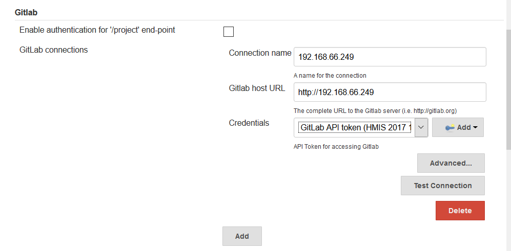

En un proximo tutorial veremos como usar un repositorio GitLab en un proyecto Jenkins.

### Configuración de SonarQube

SonarQube es una plataforma de calidad de código fuente. SonarQube proporciona diversas herramientas de análisis estático de código fuente como Checkstyle, PMD o FindBugs para obtener métricas que pueden ayudar a mejorar la calidad del código de un programa.

Primero hemos de instalar el plugin de Sonar y luego configurarlo.
* Instalación del plugin *SonarQube Scanner for Jenkins*

A continuación, *Administrar Jenkins* / *Global Tool Configuration*.
Descender en la página a la sección de configuración *SonarQube Scanner*, y:

* Hacer clic *Añadir SonarQube Scanner*
* Seleccionar *Instalar Automáticamente*
* Nombre: *SonarQube scanner 3.x.x*
* Version: _la última disponible_

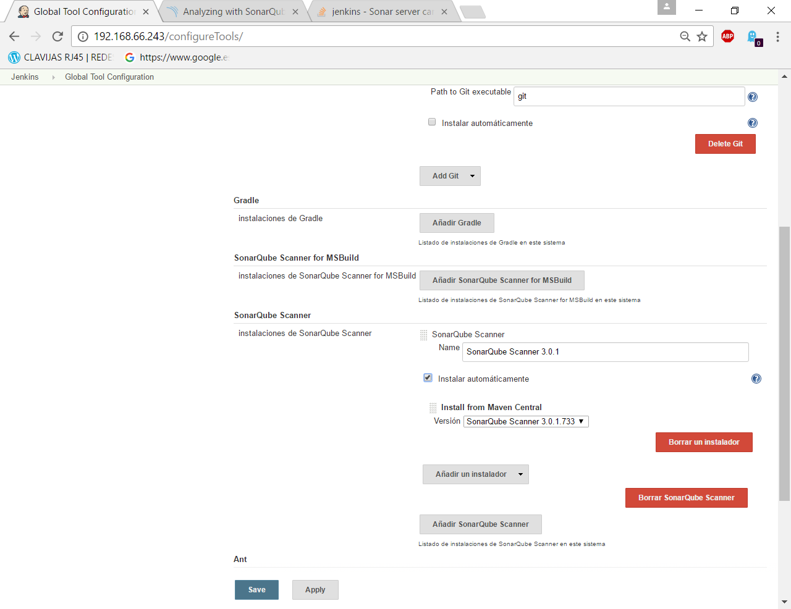

Se debe crear un token de autenticación desde el servidor SonarQube, creado como una credencial 'Secret Text'. Si aun no dispone de un servidor SonarQube, déjelo en blanco.

Por último guardar la configuración.

Más info: https://docs.sonarqube.org/display/SCAN/Analyzing+with+SonarQube+Scanner+for+Jenkins[SonarQube Scanner for Jenkins]

## Actualización
### Actualización de Jenkins

Si al iniciar Jenkins como administradores nos aparece un mensaje indicando que una nueva versión de Jenkins está disponible, es *aconsejable actualizar siempre*. 

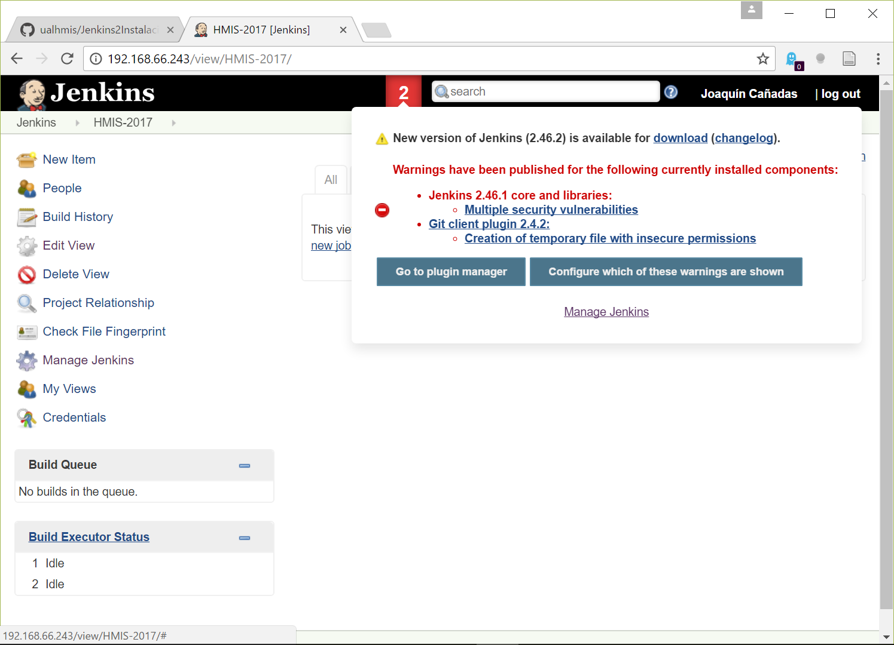

Para ello:

* Administrar Jenkins / Prepare for Shutdown

* Desde la consola ssh: 
+
[source,bash]
----
sudo apt-get update -y
sudo apt-get upgrade -y
----

### Actualización de plugins

El enlace para gestionar los plugins nos muestra si hay actualizaciones disponibles. Es recomendable actualizar siempre:

Entramos y marcamos todos con _All_ , y hacemos clic en _Descargar ahora e instalar después de reiniciar_

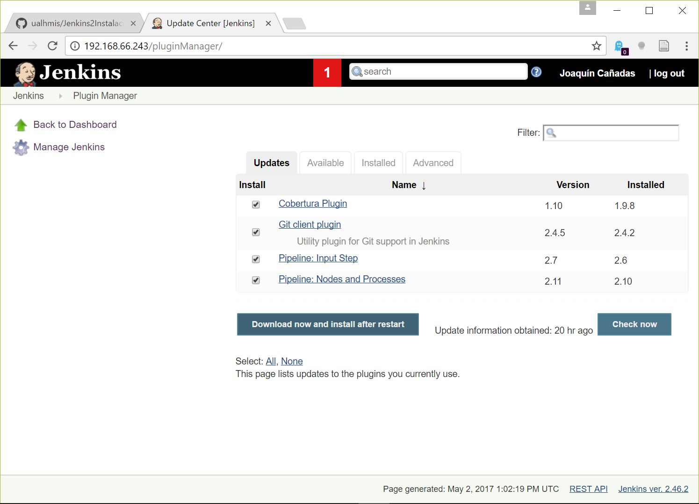

Tras ello, marcamos _Reiniciar Jenkins..._

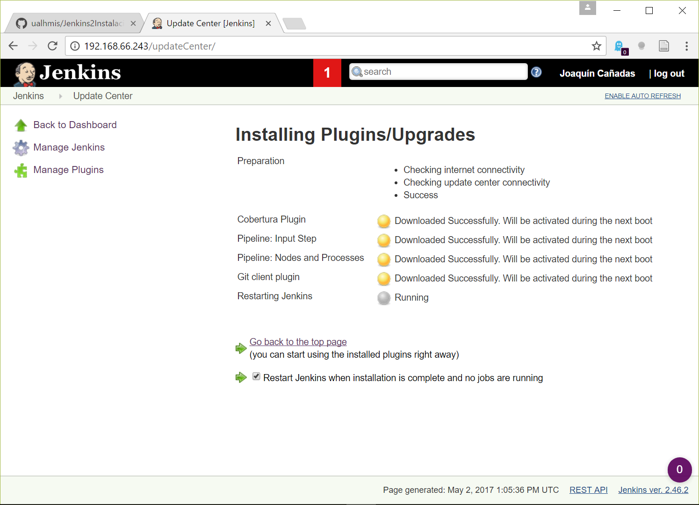
:numbered!:

# Bibliografía
## Referencias

* Jenkins 2 – Instalación de Jenkins en Ubuntu. Disponible en: https://www.jorgedelacruz.es/2017/02/14/jenkins-2-instalacion-de-jenkins-en-ubuntu/

* https://www.digitalocean.com/community/tutorials/how-to-install-jenkins-on-ubuntu-20-04-es

* https://www.howtoforge.com/tutorial/how-to-install-jenkins-with-apache-on-ubuntu-16-04/

* https://pkg.jenkins.io/debian-stable/

