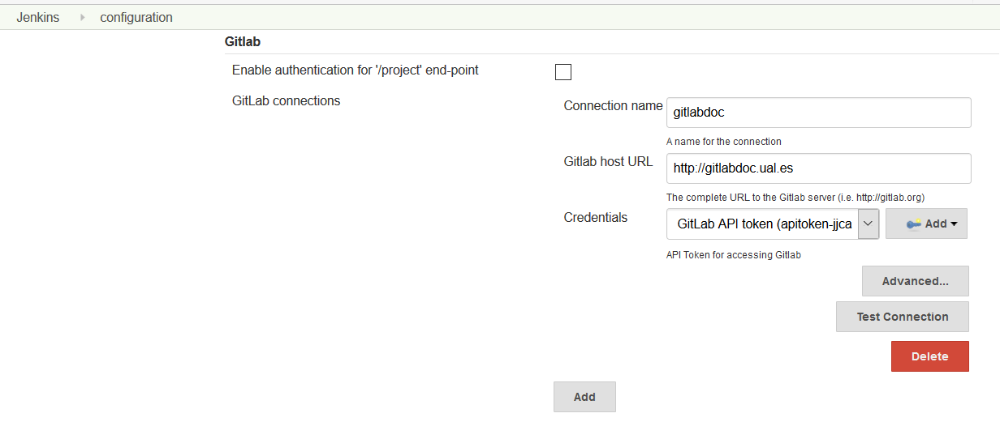
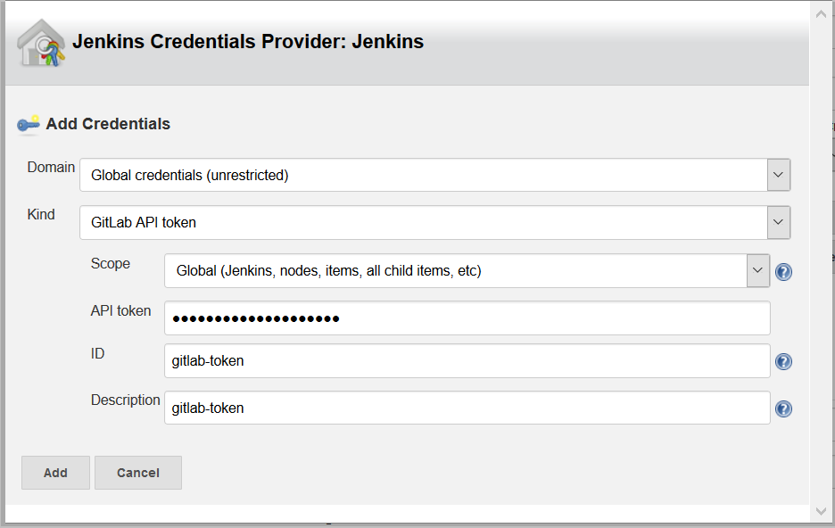
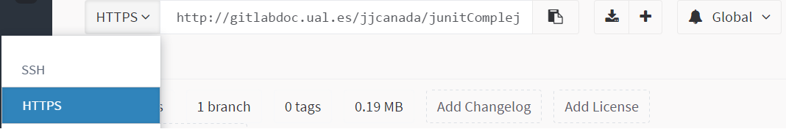
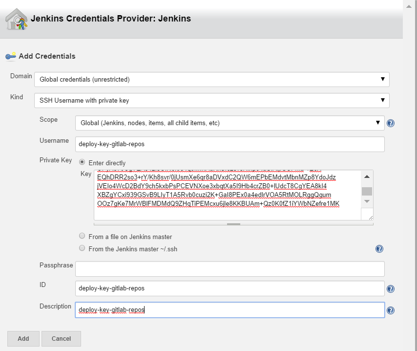
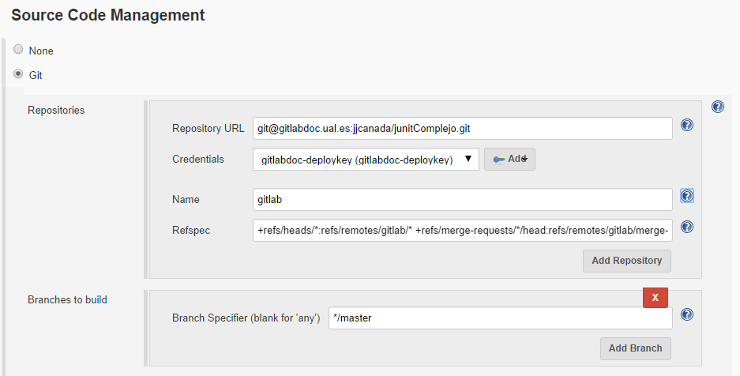
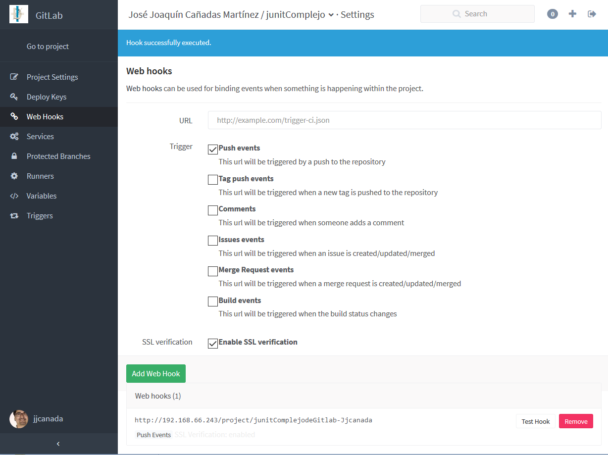
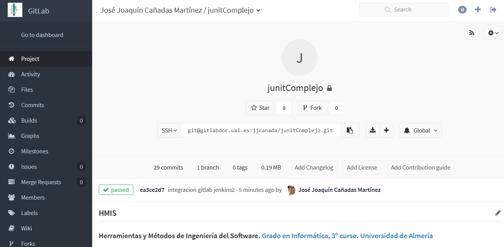
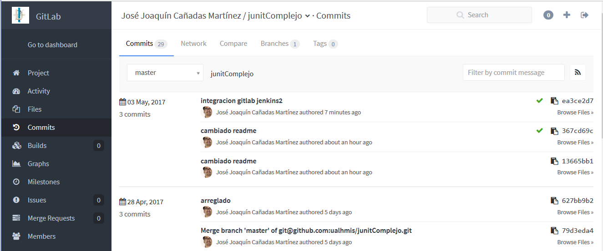

////
Codificación, idioma, tabla de contenidos, tipo de documento
////
:encoding: utf-8
:lang: es
:toc: right
:toc-title: Tabla de contenidos
:keywords: Jenkins
:doctype: book

////
/// activar btn:
////
:experimental:

////
Nombre y título del trabajo
////
= Lanzar la construcción de un proyecto en Jenkins al hacer push sobre repositorios privados en GitLab
Heramientas y Métodos de Ingeniería del Software
Version 1.0, Mayo-2017
Joaquín Cañadas <jjcanada@ual.es>

// Entrar en modo no numerado de apartados
:numbered!: 

[abstract]
////
COLOCA A CONTINUACION EL RESUMEN
////

Configuración de proyectos Jenkins y repositorios privados en GitLab para que se lance la construcción automáticamente en Jenkins cada vez que se realice un _push_ en el repositorio en GitLab

////
COLOCA A CONTINUACION LOS OBJETIVOS
////

////
////.Objetivos ////

//// * Actualizar el sistema Ubuntu 16.04 en caso de que sea necesario////
////

// Entrar en modo numerado de apartados
:numbered:

# Requisitos

Los siguientes plugins deben estar instalados en Jenkins: https://wiki.jenkins-ci.org/display/JENKINS/GitLab+Plugin[Jenkins GitLab Plugin] y https://wiki.jenkins-ci.org/display/JENKINS/Git+Plugin[Jenkins Git Plugin] 

# Configuración

## Usuario de GitLab

Copie el API token privado de su cuenta en GitLab en  **Profile Settings ->
Account**. Lo necesitará más adelante para la configuración del servidor Jenkins.

image::images/gitlab-token.png[gitlab token]

## Configuración del servidor Jenkins

Vaya a **Administrar Jenkins -> Configuración del sistema **

Descienda hasta la sección **Gitlab**

Introduzca: 

  * Un nombre para la conexión al servidor GitLab 
  * La URL del servidor GitLab
  * Añada las credenciales para GitLab usando el token de su usuario:
  ** Seleccione _GitLab API token_
  ** Pegue el token copiado anteriormente
  ** Escriba un identificador de la credencial

Una vez añadida la credencial, seleccionelá. Pruebe la conexión con **Test connection**.

## Configuración del proyecto Jenkins

Cree una **nueva tarea** en Jenkins.

1. En la sección _Gestión de Código Fuente_:

* Seleccione Git
* Introduzca la URL del repositorio en GitLab
* Añada las credenciales para acceder al repo en GitLab
+
image::images/jenkins-scm-git-ssh.png[jenkins-scm-git-ssh]

** Si ha utilizado la URL _https_ del repositorio, tendrá que introducir las credenciales tipo _usuario/contraseña_ de GitLab.
+

** Si por el contrario ha utilizado la URL _git_ del repositorio, tendrá que intruducir unas credenciales tipo _SSH username con Private key_. 
+
image::images/gitlab-repo-url-ssh.png[gitlab-repo-url-ssh]
+
Para evitar tener que introducir su clave privada personal en Jenkins, se debe **crear una nueva pareja de claves ssh** denominadas _de despliegue_, de manera que:

    *** al repositorio GitLab se le añade la clave pública _de despliegue_, 
    *** y en Jenkins se añade la clave privada _de despliegue_.
+

+
De esta forma, Jenkins usará la clave privada para acceder al repositorio _privado_ en GitLab. 

** Seleccione la credencial añadida.
*  En __Advanced settings__, introduzca:  
    ** Nombre del repositorio remoto, normalmente _origin_ que identifica al repositorio remoto entre otros posibles remotos. En nuestro caso, lo hemos llamado _gitlab_ ya que _origin_ está usado por en el ejemplo para el remoto en _GitHub_
    ** Refspec:
+
[listing]
_+refs/heads/*:refs/remotes/gitlab/* +refs/merge-requests/*/head:refs/remotes/gitlab/merge-requests/*_
+
El valor predeterminadode Refspec es
+
[listing]
_+refs/heads/*:refs/remotes/REPOSITORYNAME/*_
+
observe que hemos usado _gitlab_ en _REPOSITORYNAME_, aunque el valor habitual sería _origin_
+

2. En la sección _Build Triggers_: 
* Seleccione _Build when a change is pushed to GitLab_
+ 
Copie la URL que se muestra en la misma línea como  __GitLab CI Service URL__ porque la usará más tarde para definir el GitLab web hook.
+
image::images/jenkins-gitlab-build-chen-a-change-is-pushed.png[jenkins-gitlab-build-chen-a-change-is-pushed]

3. Añada un nuevo paso _post-build_ seleccionando _Publish build status to GitLab commit (GitLab 8.1+ required)_ 
+
image::images/jenkins-publish-build-status.png[jenkins-publish-build-status]

4. Guarde los cambios!

## Configuración del repositorio GitLab

En GitLab vaya a su repositorio y haga clic en  __Settings__

Haga clic en  __Web Hooks__

* En URL introduzca la URL que ha copiado anteriormente en Jenkins asociada al __GitLab CI Service URL__, que es de la forma 
[source]
----
http://JENKINS_URL/project/JENKINS_PROJECT_NAME
----
* Selecione _Merge Request Events_ y _Push Events_
* Clic en _Add Webhook_
* Clic en _Test Hook_ para probar el nuevo web hook. Verá dos resultados:
    ** GitLab mostrará  _Hook successfully executed_ 

    ** El proyecto Jenkins comenzará a ejecutarse

image::images/jenkins-build-from-gitlab.png[jenkins-build-from-gitlab]

La conexión ya está hecha!

Pruebe a realizar cambios en los archivos del repositorio, guardarlos y hacer push en GitLab. Tras la construcción en Jenkins, verá que en el repositorio GitLab aparece un nuevo icono con el resultado del build:

Si hace clic sobre él, verá la página del commit asociado al build. 

image::images/gitlab-commit-build-passed-icon.png[gitlab-commit-build-passed-icon]

Y en la lista de commits, a partir de ahora aparecerá un nuevo icono con el estado del build asociado a cada commit.

:numbered!:

# Bibliografía

* https://docs.gitlab.com/ee/integration/jenkins.html#jenkins-ci-integration
* https://github.com/jenkinsci/gitlab-plugin#gitlab-configuration

